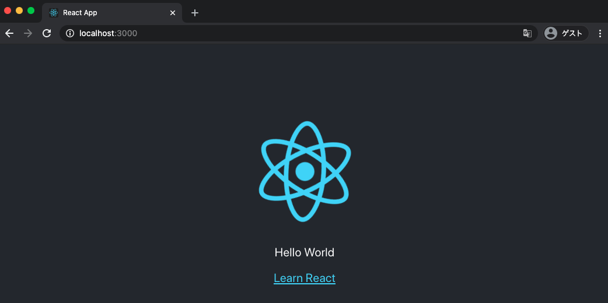
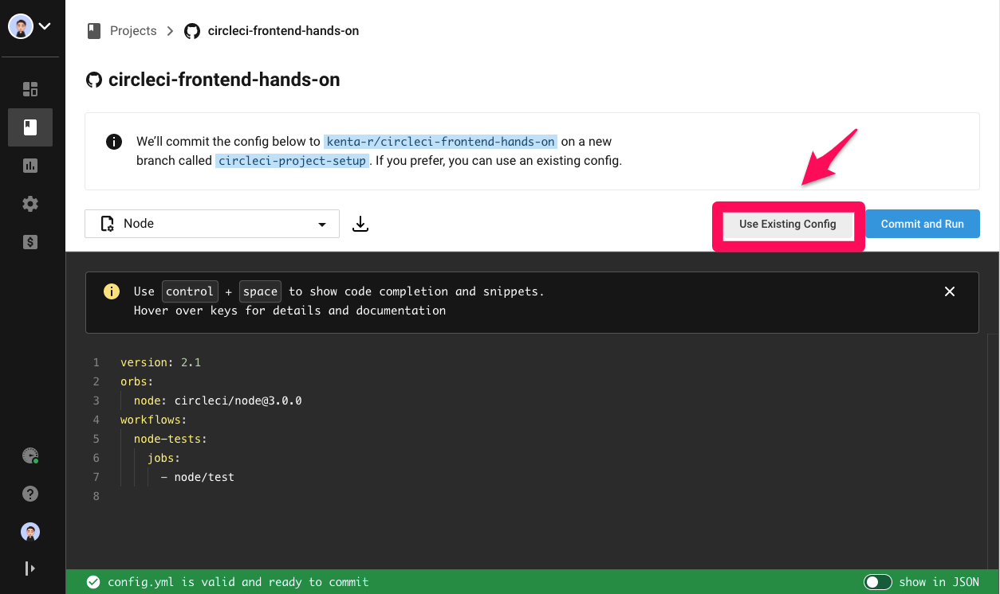
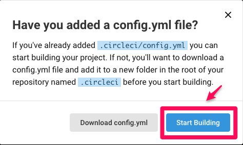
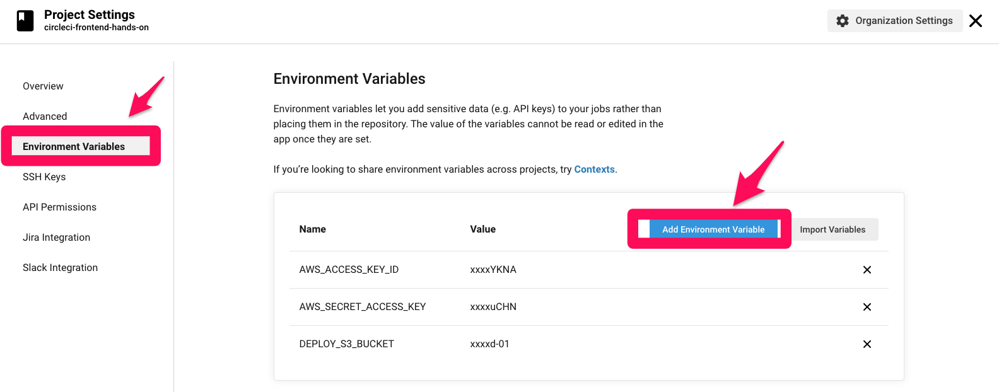

# 準備
事前準備のS３作成は[こちら](準備.md)を実施ください。

# ハンズオン①
## アカウントを準備する
### GitHubアカウントの準備
[こちらのURL](https://docs.github.com/ja/github/getting-started-with-github/signing-up-for-a-new-github-account)からアカウントを登録する
### CircleCIアカウントの準備（GitHubアカウントでログイン）
[こちらのURL](https://circleci.com/ja/integrations/github/)からアカウントを登録する

# ハンズオン②
ソースコードをダウンロードし、フロントエンドアプリを実行する
```
git clone git@github.com:kenta-r/kenta-r-circleci-hands-on-frontend.git
cd circleci-frontend-hands-on
npm install
npm build
```
こちらの画面が表示されればOK!


ご自身のリポジトリにソースコードをPushする
```
git add .
git commit -m "first commit"
git push -u origin main
```


# ハンズオン③
CircleCIを設定する
## GitHubとの連携
CircleCIの[アプリ画面](https://circleci.com/)に移動し、プロジェクトを連携してください。

今回はすでにあるCircleCIの設定ファイルを使用します。

今回はそのままビルドを開始してください。


## 環境変数の設定
ビルドがスタートしますが、設定がまだ終わっていないのでキャンセルし、環境変数の設定に進みます。

環境変数を選択したら、AWSへのアクセスキーやデプロイ先のS3名を記載してください。
| 設定値 | 値 |
| -------- | -------- | 
| AWS_ACCESS_KEY_ID | 各自入手 | 
| AWS_SECRET_ACCESS_KEY | 各自入手 |
| DEPLOY_S3_BUCKET | 各自入手 |


# ハンズオン④
## CircleCIを動かしてS3にアプリケーションをデプロイする
下の画像のように正常に動いていればOKです。


# ハンズオン⑤　時間が余ったら
## 通知機能の実装

### 通知するためのWebhookを作成する
以下のURLから通知先を選択する
https://slack.com/services/new/incoming-webhook

取得したWebhookURLを環境変数に設定する

| 設定値 | 値 |
| -------- | -------- | 
| SLACK_WEBHOOK | 先ほど入手したURL | 

### CircleCIに設定する
以下の項目を変更し、再度実行する。(インデントも入っているので注意)

orbsの情報を追記
```
version: 2.0
→
version: 2.1
orbs:
  slack: circleci/slack@4.3.0
```

通知したい場所に追記①
```
      - buildApp:
→
      - buildApp:
          post-steps:
            - slack/status:
                fail_only: true
```

通知したい場所に追記②
```
      - devDeployApp:
          requires:
            - devholdApproval
          filters:
            branches:
              only:
                - main
→
      - devDeployApp:
          requires:
            - devholdApproval
          filters:
            branches:
              only:
                - main
          post-steps:
            - slack/status:
```

以下のように通知がされていればOK！！


以上です。
お疲れ様でした。